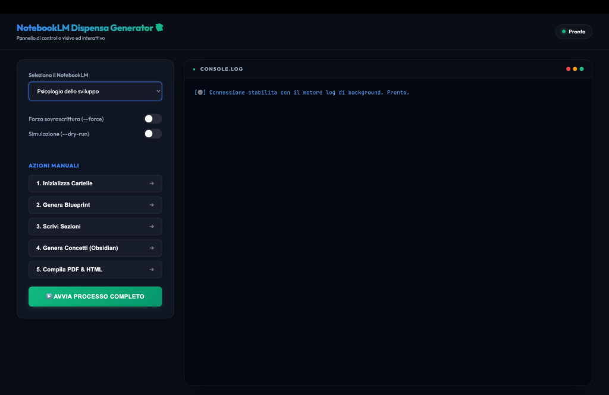

# NotebookLM Dispensa Generator 📚🤖

Uno strumento potente, resiliente e autogestito in Python per convertire lezioni registrate (file audio), slide e note di corsi universitari caricate in **Google NotebookLM** in dispense di studio complete e strutturate, corredate da schede concettuali collegate (in formato Obsidian Wikilink) e PDF esportabili con un layout grafico professionale di alta qualità.

Il programma offre sia una comoda **Dashboard Web locale interattiva (GUI)** sia una potente **interfaccia a riga di comando (CLI)**.



---

## 🌟 Caratteristiche Principali

1. **Dashboard Web Locale (GUI)**:
   * Interfaccia visiva scura e moderna (stile Glassmorphism) sviluppata con Flask.
   * Rileva in automatico i notebook esistenti sul tuo account e ti permette di selezionarli tramite un comodo menu a tendina (o di crearne uno nuovo al volo).
   * Console log in tempo reale tramite connessione **Server-Sent Events (SSE)** per monitorare lo stato di avanzamento delle chiamate e delle compilazioni riga per riga.
   
2. **Selezione Interattiva del Notebook (CLI)**:
   * Se avviato da terminale senza specificare un notebook, mostra un menu nativo navigabile con le **frecce direzionali (`⬆️` / `⬇️`)** e tasto **`INVIO`** per selezionare il notebook desiderato direttamente dalla tastiera.

3. **Profilazione & Pianificazione Didattica Multi-Step**:
   * Suddivide il processo di stesura in 5 step incrementali (Profilazione, Struttura Capitoli, Sotto-Sezioni, Audit Sillabo, Verifica Fonti).
   * Evita i limiti di token e le risposte incomplete di NotebookLM costringendolo a pianificare batch di sezioni progressivamente, supportando stesure su vasta scala.

4. **Resilienza e Ripresa (State Machine Checkpoints)**:
   * Lo stato viene salvato progressivamente in `blueprint_state.json`. In caso di interruzioni di rete, errori API o crash, il programma riprenderà esattamente dal capitolo o dallo step in cui si è fermato, senza perdere il lavoro pregresso.

5. **Resistenza ai Limiti API & Backoff**:
   * Implementa un algoritmo di retry con **backoff esponenziale e jitter** basato sull'orologio di sistema (nanosecondi) per evitare conflitti o blocchi temporanei dovuti a rate-limiting.
   * Timeout configurato su ciascuna chiamata per prevenire blocchi indefiniti.

6. **Audit di Copertura Automatico**:
   * Esegue un controllo di consistenza confrontando la bozza della dispensa pianificata con le slide e il sillabo ufficiale. Identifica automaticamente eventuali argomenti d'esame tralasciati e li inietta nel blueprint prima di scrivere il testo.

7. **Schede Concettuali per Obsidian Vault**:
   * Estrae i termini e i concetti chiave da ciascuna sezione e genera schede di definizione dedicate in formato Markdown.
   * Supporta la sintassi nativa degli Obsidian Wikilink con alias (`[[Concetto|Alias]]` e `[[path/to/Page]]`) per consentire la visualizzazione e navigazione tramite il grafo semantico nativo di Obsidian.

8. **Compilazione Premium HTML & PDF**:
   * Unifica tutte le sezioni scritte in un'unica dispensa finale.
   * Genera automaticamente una **Table of Contents (TOC)** nidificata ed elegante (capitoli e paragrafi) basata su regole CSS premium.
   * Compila il file finale in PDF tramite Weasyprint, Google Chrome Headless, o Pandoc/LaTeX a seconda di cosa è installato sul sistema ospite.

---

## 📂 Struttura del Progetto

```text
dispensa_generator/
├── config.py              # Gestione della configurazione locale e autenticazione NotebookLM CLI
├── prompts.py             # Raccolta dei prompt strutturati in italiano per la generazione didattica
├── logging_utils.py       # Utilità di logging condivisa e callback per lo streaming in tempo reale
├── main.py                # Core application: gestione CLI, pipeline, state machine ed interactive CLI menu
├── compiler.py            # Parser Markdown, Wikilink resolver e compilatore HTML/PDF
├── gui.py                 # Dashboard Web locale (interfaccia grafica a scorrimento log SSE)
├── run.sh                 # Script wrapper bash con direttive di hardening (set -euo pipefail)
├── requirements.txt       # Dipendenze Python necessarie (Flask, Dotenv, Markdown, Jinja2, NotebookLM)
├── LICENSE                # Licenza MIT del software
└── README.md              # Documentazione del progetto (questo file)
```

---

## 🛠️ Requisiti di Sistema

* **Python**: versione `3.9` o superiore.
* **NotebookLM CLI**: La CLI ufficiale di Google NotebookLM installata sul sistema e autenticata con il proprio account Google Cloud/Workspace.
* **Compilatore PDF (Opzionale)**: Google Chrome / Chromium (consigliato su Mac/Windows per un rendering fedele di MathJax/Mermaid) oppure `weasyprint` o `pandoc` con `xelatex`.

---

## 🚀 Installazione e Primo Avvio

1. Clona la repository o copia i file in una cartella locale.
2. Installa le dipendenze Python:
   ```bash
   pip3 install -r requirements.txt
   ```
3. Inizializza la struttura delle cartelle locali e verifica l'autenticazione a Google NotebookLM:
   ```bash
   python3 main.py -a init
   ```
   Questo comando creerà le seguenti cartelle nella root del progetto:
   * `raw_sources/`: cartella dove posizionare le trascrizioni (.txt), slide (.pdf) o note.
   * `output/`: cartella in cui verranno posizionati il blueprint, il log di sistema e i file finali.

---

## 🖥️ Come Avviare l'Interfaccia Grafica (Consigliato)

Per una gestione semplice e visiva di tutto il processo senza toccare il terminale:

1. Avvia la Dashboard Web:
   ```bash
   python3 gui.py
   ```
2. Il programma aprirà automaticamente una nuova scheda nel tuo browser all'indirizzo locale: **`http://127.0.0.1:5001`**.
3. Seleziona il tuo notebook dal menu a tendina dinamico (o creane uno nuovo), imposta le spunte come desideri e clicca su **Avvia Processo Completo** o sui singoli step numerati!

---

## 📖 Guida all'Utilizzo da Terminale (CLI)

Se preferisci usare il terminale classico, il generatore si pilota tramite argomenti standard:

### 1. Avvio Interattivo (Selezione Notebook con Frecce)
Lancia il programma senza specificare il notebook per navigare tra i notebook del tuo account con le frecce della tastiera:
```bash
python3 main.py -a all
```

### 2. Comando Diretto con Nome Notebook
```bash
python3 main.py -n "Nome_Notebook" -a all
```

### 3. Azioni Singole manuali
Puoi eseguire i singoli step separatamente:
* **Generazione Blueprint**: `python3 main.py -n "Nome_Notebook" -a blueprint`
* **Micro-stesura**: `python3 main.py -n "Nome_Notebook" -a write`
  * *Rigenerare una singola sezione*: `python3 main.py -n "Nome_Notebook" -a write --section 1.2 --force`
* **Schede Concettuali**: `python3 main.py -n "Nome_Notebook" -a concepts --concept-chunk-size 5`
* **Compilazione PDF**: `python3 main.py -a compile`

### 🧪 Modalità Simulazione (Dry-run)
Aggiungi `--dry-run` a qualsiasi comando per simulare l'operazione senza consumare quote API o modificare file online:
```bash
python3 main.py -n "Nome_Notebook" -a all --dry-run
```

---

## 🛡️ Sicurezza e Best Practices

* **Nessun Dato Sensibile**: Non caricare mai chiavi API o password nella repository. Il file `.env` locale viene automaticamente ignorato da Git grazie al file `.gitignore`.
* **Mappatura delle Fonti**: Assicurati che i nomi delle fonti indicati nel blueprint corrispondano esattamente o inizino con gli stessi caratteri dei titoli dei file caricati nel notebook su Google NotebookLM per garantire una precisione del 100% durante l'estrazione.

---

## 📄 Licenza

Questo progetto è rilasciato sotto i termini della licenza **MIT**. Consulta il file `LICENSE` per ulteriori dettagli.
